# 桌游卡牌与版图 — 提示词合集


> 34 个案例


## Metadata

适用关键词：桌游、桌面游戏、Board game、卡牌游戏、实体卡牌、牌面、版图、地图板、玩家面板、资源板、游戏组件、桌游封面、盒面、包装、扩展包封面、token、tile、帮助卡、规则图解
适合任务：桌游卡牌正面、卡牌合集、游戏版图、地图板、玩家面板、资源/行动面板、桌游盒面/封面、扩展包包装、组件展示、规则机制图、卡牌视觉系统
不适合任务：纯 App UI、纯商品电商海报、非游戏角色立绘、无规则结构的氛围插画、纯摄影写真
可作为主库：最终交付物是桌游卡牌、版图、实体组件、玩家板、桌游盒面/封面、规则帮助卡或桌游视觉系统
可作为辅助库：为人物角色、插画、UI、信息图、海报、电商展示补充桌游组件语言和规则层级
常见交叉库：人物与角色、UI与界面、图表与信息可视化、海报与排版、插画与艺术、商品与电商、场景与叙事
必要槽位：组件类型、游戏题材、玩家视角、规则信息层级、比例/尺寸、语言、是否印刷、是否需要系列一致性
可默认槽位：简体中文；卡牌默认正面平视；版图默认俯视；组件信息少量可读；边框和图标系统统一
必须确认槽位：用户说“卡牌”时确认牌面正面图/产品效果图/系列卡牌/合集图；用户说“版图”时确认是可玩地图、规则示意还是宣传视觉；用户说“封面/盒面”时确认盒面正面、盒子效果图、宣传封面海报或系列包装
优先输出形态：卡牌正面图、卡牌合集、游戏版图、地图板、玩家面板、资源板、桌游盒面正面图、扩展包封面、规则帮助卡
默认比例：卡牌 2:3 或 3:4；卡牌合集 16:9 或 4:5；版图 1:1/4:3/16:9；玩家面板 4:3 或横版 16:9；盒面封面 1:1、2:3 或 3:4；扩展包横幅 16:9
默认语言：默认简体中文；除非用户要求，不主动加入英文标题或英文属性
常见误判：不要把卡牌做成普通角色插画；不要把版图做成无规则的奇幻地图；不要把玩家面板做成手机 App UI；不要把盒面封面做成普通插画或电商促销海报
关联 recipe / template：recipes/boardgame-card.md；recipes/boardgame-cover.md；recipes/boardgame-ui.md；recipes/boardgame-rulebook.md；recipes/boardgame-promo.md；recipes/series-generation.md；recipes/infographic.md；references/awesome-boardgame-cases.md
检索建议：优先检索组件类型、题材、视角、信息密度、封面构图、标题区、角色群像、图标系统、边框/格子/路径结构和是否需要印刷正交

---


## 例 900：角色职业卡牌矩阵

**来源：** 用户新增本地参考图

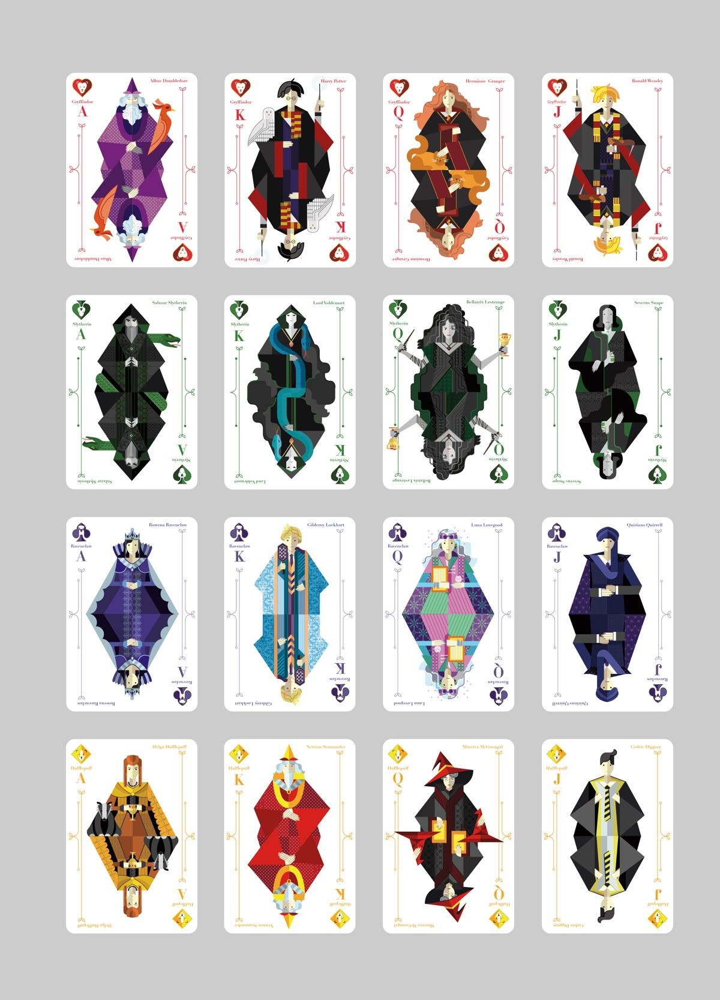

```text
生成一张桌游角色职业卡牌合集图，白色背景，4 列 x 5 行整齐排列 20 张小型角色卡。
每张卡使用统一的竖版牌面框架：顶部角色名称区，中部全身角色立绘，底部小型属性/阵营符号。
角色来自同一套奇幻/冒险桌游职业系统，包含战士、法师、游侠、盗贼、祭司、炼金术士、机械师等不同职业。
视觉风格为精致手绘插画，角色轮廓清楚，服装差异明显，配色丰富但统一。
所有卡牌尺寸、边框、留白、标题位置保持一致，像一套完整可印刷的角色卡原型。
避免：不要做成散乱贴纸；不要加入桌面透视；不要让每张卡风格漂移；不要出现难以辨认的小字。
```

**可迁移结构：** 多张角色卡统一矩阵 + 固定牌框 + 仅变化角色职业、主色和姿态。

---


## 例 901：极简几何技能卡

**来源：** 用户新增本地参考图

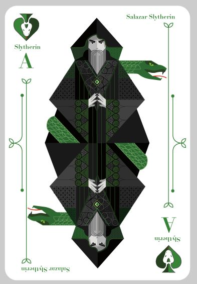

```text
生成一张极简桌游技能卡正面图，竖版 2:3，纯正面平视，完整卡牌居中。
卡面以黑白灰为主，使用折纸/几何切面风格的黑色高塔或斗篷人物作为中央主视觉。
顶部留出简洁标题区，角落放置绿色资源图标和少量数值，底部放一条很短的规则栏。
版式强调对称、留白、尖锐几何轮廓和少量绿色点缀，适合策略桌游中的阴谋、建筑或能力牌。
文字使用简体中文，少量清晰，不要超过 1 个卡名和 1 条短规则。
避免：不要产品摄影、不要桌面、不要复杂背景、不要过多说明文字。
```

**可迁移结构：** 低色数几何主体 + 单一强调色 + 顶角资源信息。

---


## 例 902：Q 版怪物能力卡系列

**来源：** 用户新增本地参考图

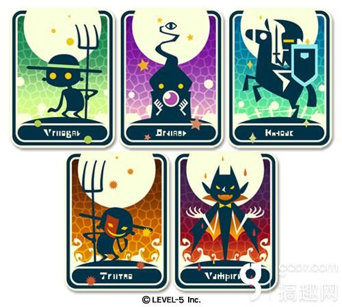

```text
生成一组 5 张 Q 版怪物能力卡，横向散点排布但每张卡保持完整可见。
每张卡为竖版圆角牌面，顶部有月相/阵营图标，中部是高对比卡通怪物头像或半身像，底部是卡名和 2-3 个小型能力符号。
风格为明亮、童趣、万圣节感的矢量插画，粗黑描边，背景色块简洁，每张怪物使用不同主色。
统一卡牌框架、标题位置、图标尺寸和底部信息栏，只改变怪物形象和强调色。
文字默认简体中文，卡名短，不要大段规则。
```

**可迁移结构：** 小体量系列卡 + 可爱怪物主视觉 + 顶部阵营图标 + 底部能力符号。

---


## 例 903：幽默怪兽角色牌

**来源：** 用户新增本地参考图

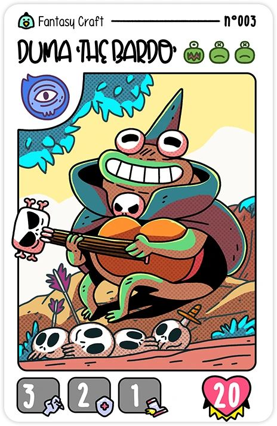

```text
生成一张幽默怪兽角色卡正面图，竖版 2:3，正交平面牌面。
中心是一只夸张表情的卡通怪兽，坐在明亮场景中，粗线条、强表情、玩具感配色。
牌面顶部是卡名和资源/费用区，右上角有圆形数值徽章；底部是属性条、图标栏和一条短规则。
整体像轻策略家庭桌游或派对卡牌，信息层级清晰，卡名醒目，图标可读。
简体中文文字，规则不超过 18 字，避免乱码和英文。
```

**可迁移结构：** 角色插画占主导 + 顶部费用 + 底部规则和属性条。

---


## 例 904：童话冒险事件卡

**来源：** 用户新增本地参考图

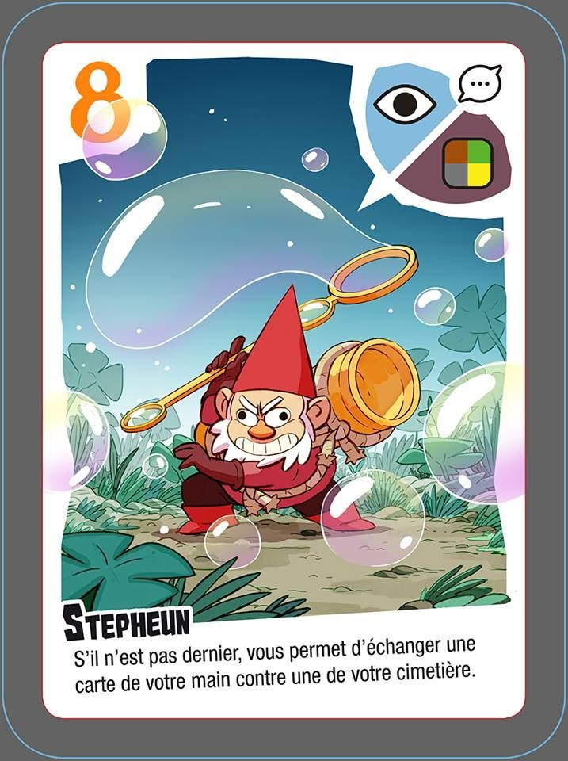

```text
生成一张童话冒险事件卡正面图，竖版卡牌，纯正面展示。
中央插画是一名小小冒险者站在山谷、彩虹或奇幻地貌前，画面温暖明亮，有儿童绘本质感。
顶部左侧放大号费用数字，顶部右侧放 2-3 个圆形小图标；底部是浅色规则文本框。
卡牌边框圆润，整体适合亲子桌游、冒险事件、旅途遭遇或技能卡。
文字使用简体中文：卡名 4-6 字，底部短规则一行。
避免：不要写实恐怖，不要过度复杂的背景，不要密集小字。
```

**可迁移结构：** 绘本主视觉 + 大费用数字 + 少量图标 + 下方规则框。

---


## 例 905：美式角色战斗卡

**来源：** 用户新增本地参考图

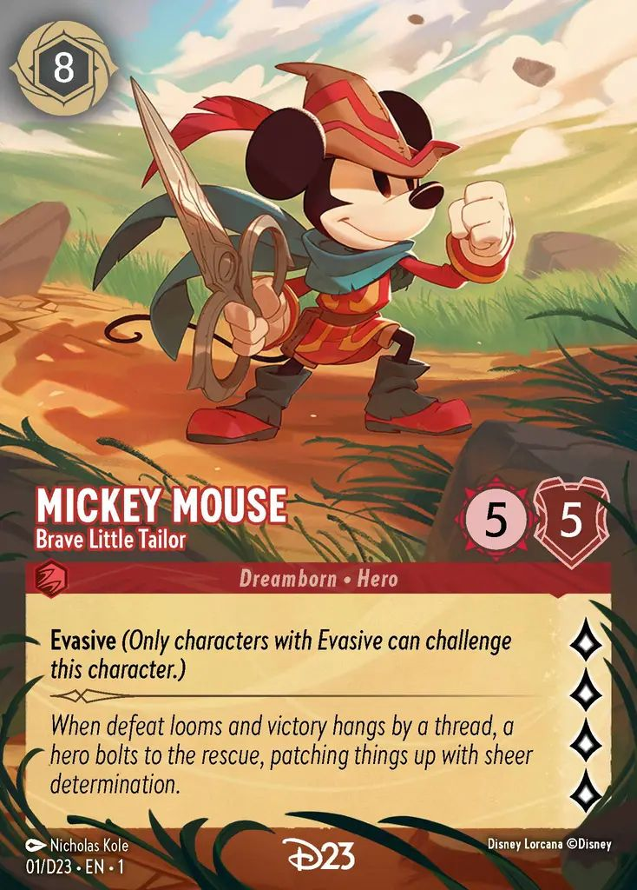

```text
生成一张美式桌游角色战斗卡，竖版 2:3，正面平视。
主视觉是一名拟人动物或冒险角色的动态插画，背景为战斗场景或荒野环境。
牌面顶部放资源费用和卡名，中部大面积插画，底部为规则文字框、关键词标签和左右攻击/生命数值。
边框厚实，底部有清晰分区，整体有实体卡牌印刷质感。
使用简体中文，底部规则控制在 2 行以内，图标和数值要明显。
```

**可迁移结构：** 美式战斗卡牌结构：费用/名称 + 大插画 + 规则框 + 攻防数值。

---


## 例 906：复古机制卡牌

**来源：** 用户新增本地参考图

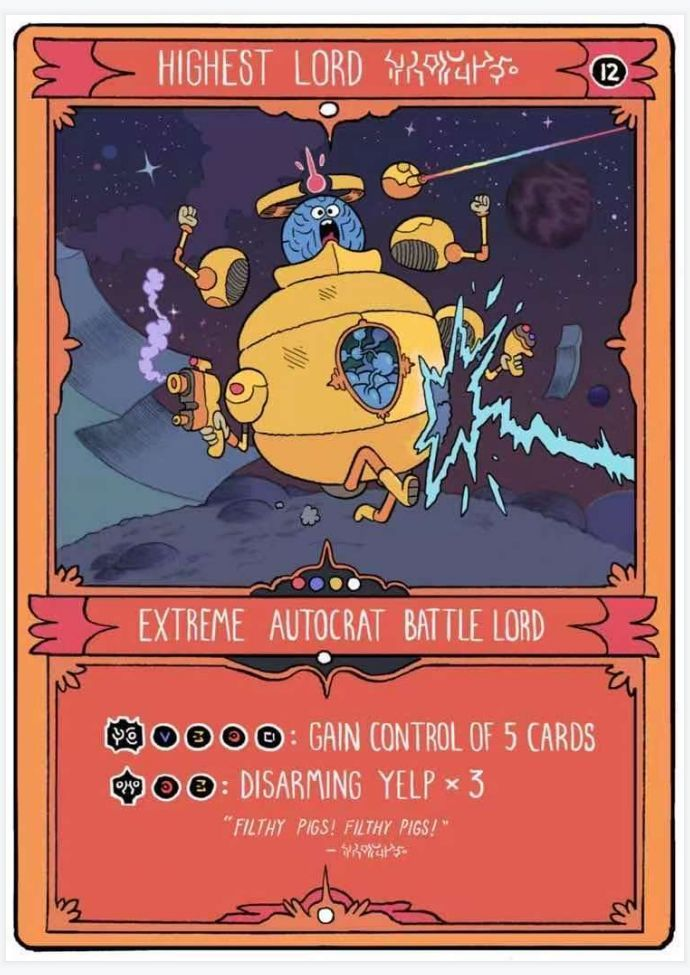

```text
生成一张复古策略桌游机制卡，竖版正面图。
卡面使用红色旧纸边框、装饰性标题条、中心圆形插画或徽章图案，整体像老式奇幻/蒸汽朋克卡牌。
底部为规则区，使用图标 + 短句组合表达效果，保留清楚的费用区和卡牌类型栏。
画面有轻微纸张纹理、印刷网点和古典装饰线，但信息仍然清晰。
简体中文文字，避免过小的说明文字，避免英文。
```

**可迁移结构：** 复古装饰框 + 中央徽章插图 + 图标化规则区。

---


## 例 907：灰蓝色怪物卡

**来源：** 用户新增本地参考图

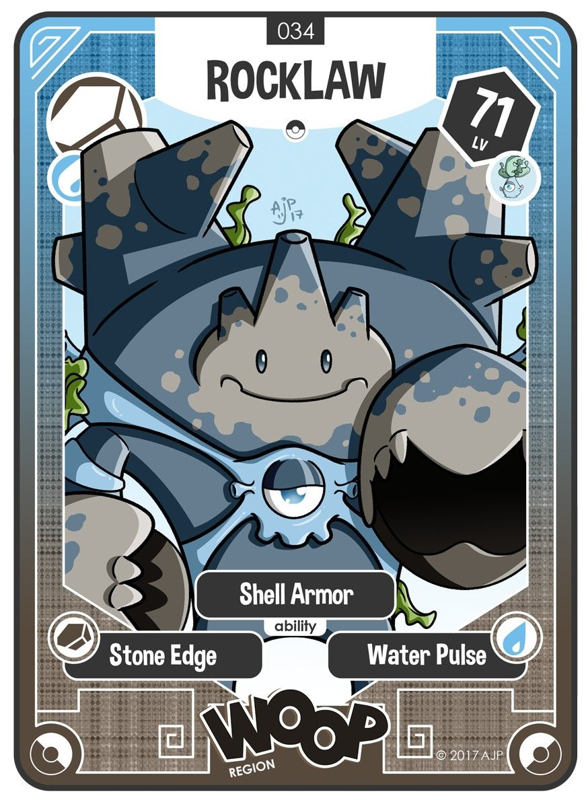

```text
生成一张灰蓝色怪物卡正面图，竖版 2:3。
中心是一只岩石、野兽或机械怪物的卡通插画，粗描边，动作清楚。
卡牌采用冷色边框，顶部卡名醒目，右上角有费用数值；底部有攻击、生命、速度或护甲等 3-4 个属性图标。
整体适合轻中度策略卡牌，版式紧凑但不拥挤。
文字简体中文，卡名短，底部规则一行。
```

**可迁移结构：** 冷色阵营卡框 + 单怪物主体 + 底部多属性图标。

---


## 例 908：高信息密度首领卡

**来源：** 用户新增本地参考图

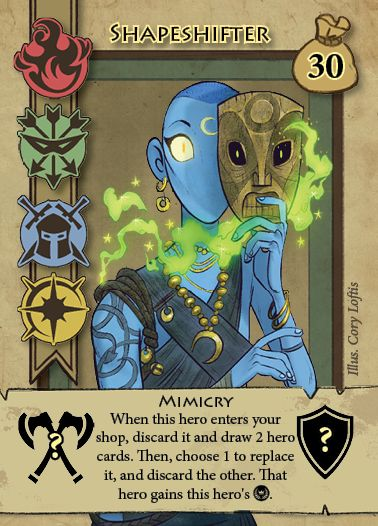

```text
生成一张高信息密度的桌游首领/敌人卡，竖版正面。
主体是一名奇幻首领或大型怪物，插画占卡面上半部，边缘环绕阵营图标、状态图标和数值徽章。
底部是规则说明区，但必须分为短标题、关键词和 1-2 条短规则，避免大段密集文字。
视觉风格为精致奇幻插画，绿色、金色或暗色系，边框复杂但层级清楚。
适合 boss 卡、敌人卡、场景遭遇卡。
```

**可迁移结构：** 首领插画 + 周边状态徽章 + 分层规则文本。

---


## 例 909：暗黑法术卡

**来源：** 用户新增本地参考图

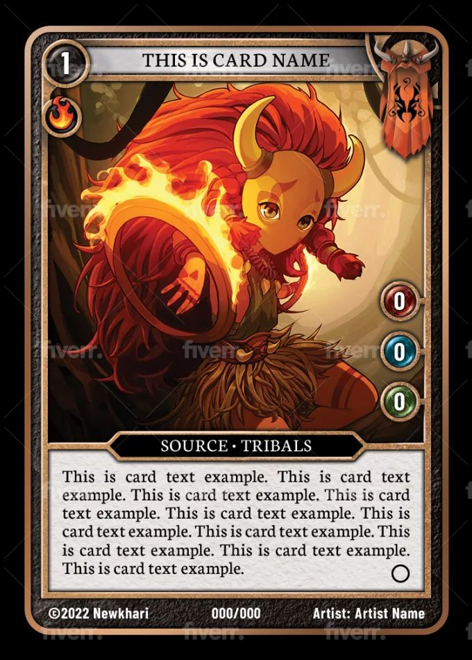

```text
生成一张暗黑奇幻法术卡正面，竖版 2:3，黑红金配色。
中央插画是一团火焰、恶魔契约或魔法爆发，光影强烈，边框有金属和暗纹装饰。
顶部是费用和法术名称，底部是浅色规则文本框，右下角可有小型阵营或稀有度符号。
整体像硬核卡牌游戏中的火焰法术、诅咒或事件牌。
简体中文，文字少量可读，禁止英文和乱码。
```

**可迁移结构：** 暗色高对比法术主视觉 + 传统 TCG 顶底分区。

---


## 例 910：经典 TCG 单位牌

**来源：** 用户新增本地参考图

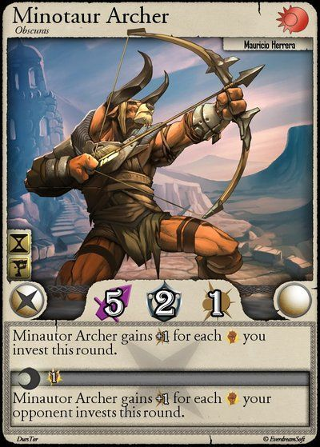

```text
生成一张经典交易卡牌游戏风格的单位牌，竖版正面。
上半部是写实奇幻角色插画，例如弓箭手、骑士、召唤物或守卫；下半部为规则框和属性栏。
卡框有阵营颜色、费用圆标、攻击/防御/生命等数值，信息区边界明确。
整体有传统卡牌游戏的收藏感和印刷质感，但文字必须简短清晰。
默认简体中文，不要引用真实游戏名称、真实品牌或受版权保护的卡名。
```

**可迁移结构：** 经典 TCG：插画窗口 + 规则文本框 + 底部属性。

---


## 例 911：奇幻生物档案牌

**来源：** 用户新增本地参考图

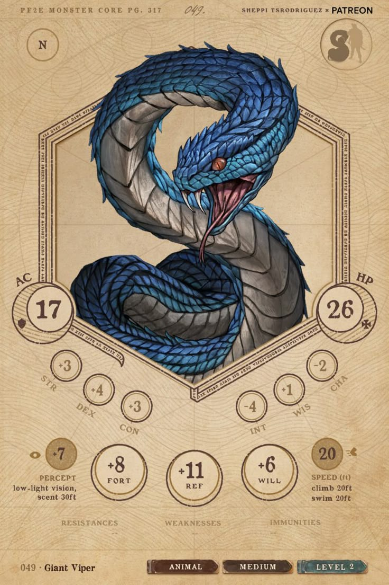

```text
生成一张奇幻生物档案牌，竖版旧纸质感。
中央是手绘生物图鉴插画，例如蛇、龙、精灵兽或遗迹生物，周围留出细线标注和装饰符号。
左右或底部放置少量属性圆标、等级数字和图鉴式短说明。
整体像博物学图鉴与桌游怪物牌结合，纸张纹理、墨线、淡彩上色，安静但有规则感。
文字使用简体中文，信息分区不要超过 5 个。
```

**可迁移结构：** 图鉴插画 + 环绕属性符号 + 古籍纸面。

---


## 例 912：数据化蛇类怪物牌

**来源：** 用户新增本地参考图

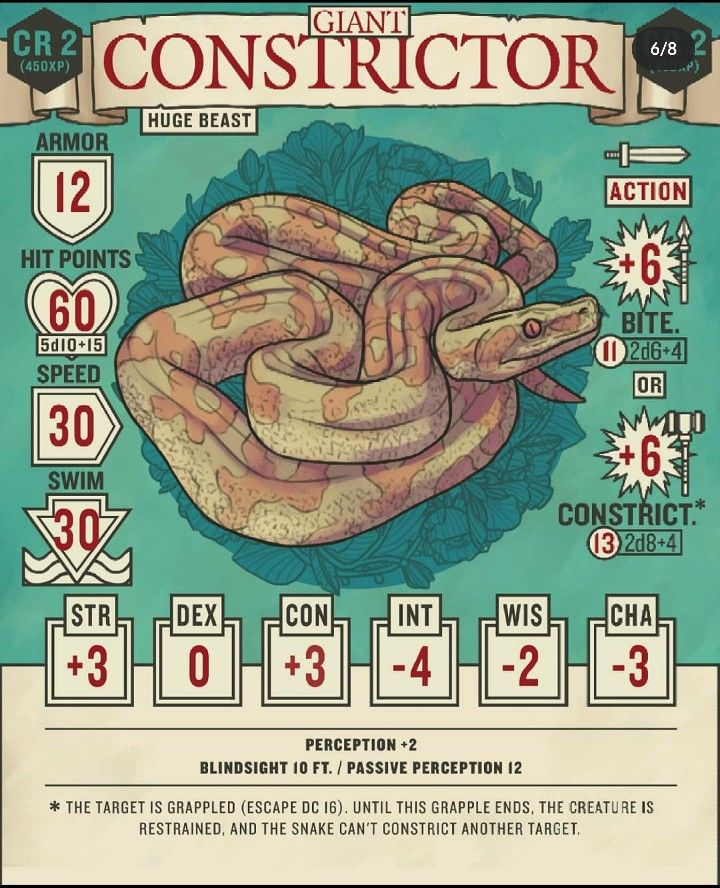

```text
生成一张数据化怪物卡，竖版，中心是一条盘绕的巨蛇或怪物图标。
卡牌四周排列多个属性轨道、等级数字、伤害/防御/速度图标，像战术桌游的敌人数据卡。
配色为复古青绿、米色、红色和黑线，带轻微旧印刷质感。
布局需要非常清楚：卡名顶部，主体居中，左右属性列，底部能力图标栏。
文字简体中文，属性标签短，避免大段描述。
```

**可迁移结构：** 中央怪物 + 左右属性数值列 + 底部能力图标。

---


## 例 913：极简资源卡

**来源：** 用户新增本地参考图

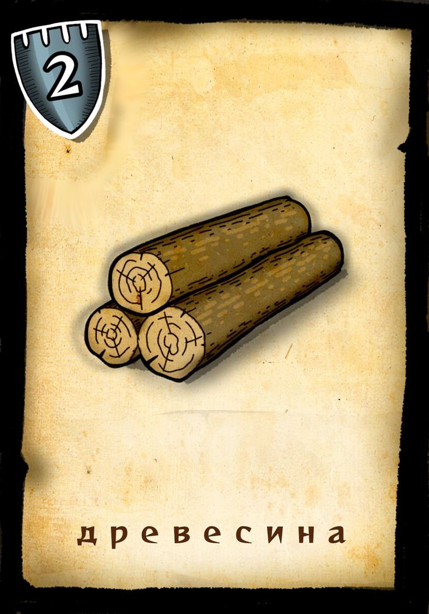

```text
生成一张极简资源卡正面图，竖版 2:3。
卡面以浅米色纸张为背景，中间放一个清晰的资源插画，例如木材、石料、粮食、金币或水晶。
左上角放费用/数量数字，底部仅写资源名称，不写复杂规则。
边框朴素，留白充足，适合欧式策略桌游资源牌。
简体中文，资源名 2-4 字，图标要大而可识别。
```

**可迁移结构：** 单资源图标 + 大留白 + 极简名称区。

---


## 例 914：建设行动牌

**来源：** 用户新增本地参考图

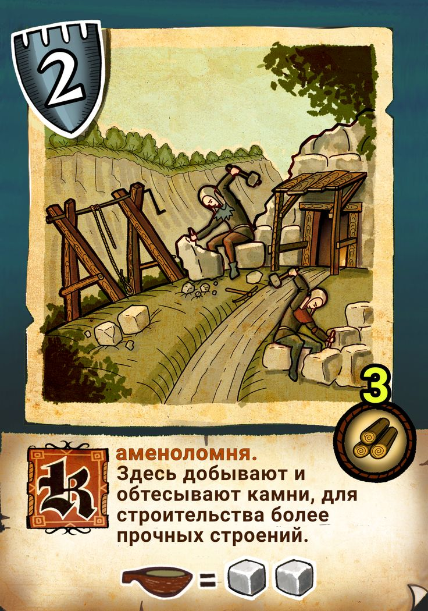

```text
生成一张建设行动牌正面，竖版卡牌。
中央插画表现道路、木桥、工人、建筑材料或村庄建设场景，风格为手绘欧式桌游插画。
左上角有费用数字，底部有橙色或棕色行动条，包含 2-3 个资源图标和一条短规则。
整体适合资源转换、建筑、行动选择类桌游。
文字简体中文，信息清晰，避免复杂长句。
```

**可迁移结构：** 场景插画 + 费用 + 底部资源转换规则。

---


## 例 915：玩家面板与卡牌系统板

**来源：** 用户新增本地参考图

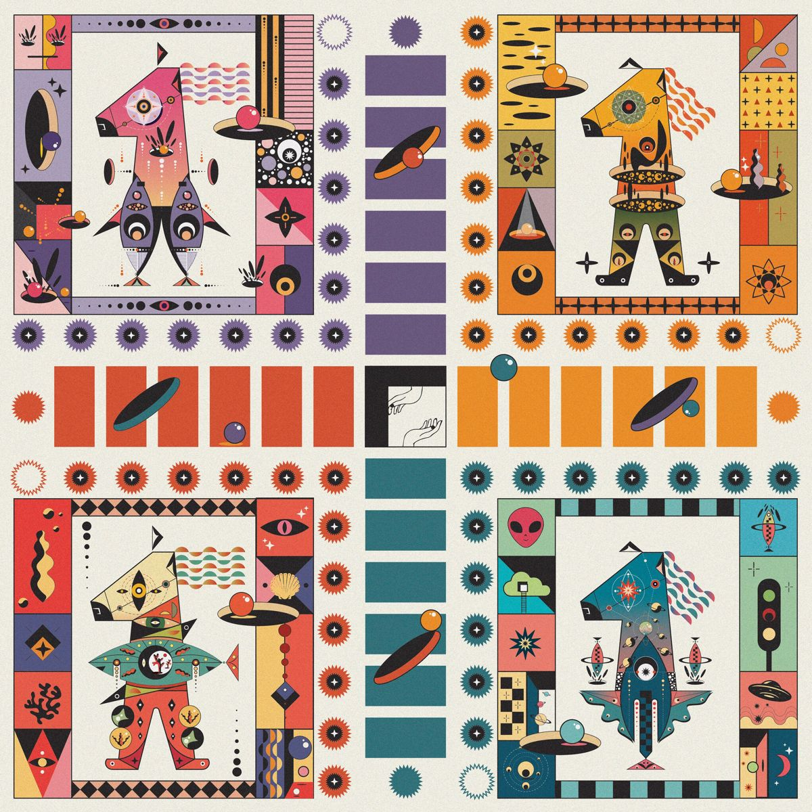

```text
生成一张桌游玩家面板/个人版图设计图，正面俯视，画面展示 4 个不同玩家颜色的面板区。
每个面板包含角色插画、资源轨道、卡槽、圆形 token 位置、行动图标和计分区。
整体为明亮可爱的插画风格，红、蓝、黄、黑或不同玩家色区分明显。
版式必须像可印刷的玩家板，而不是手机 UI；所有模块边界、格子、卡槽和 token 位清晰。
文字使用简体中文，尽量用图标表达规则，少量标签即可。
```

**可迁移结构：** 玩家色分区 + 卡槽/资源轨道/token 位 + 可印刷面板。

---


## 例 916：儿童路径型游戏版图

**来源：** 用户新增本地参考图

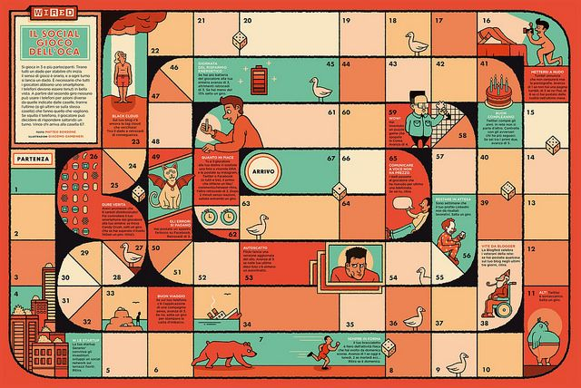

```text
生成一张儿童桌游路径型版图，横版 4:3，俯视正交。
版图使用明亮红、绿、米色格子，中央是一条循环路径或蛇形路线，周围有插画场景、起点终点、事件格和任务区。
左侧或角落保留规则摘要框，整体像亲子桌游折叠板，可直接打印。
格子数量适中，每个格子边界清晰，图标大而可识别。
避免：不要做成抽象海报；不要加入透视桌面；不要让路径难以追踪。
```

**可迁移结构：** 循环路径 + 事件格 + 角落规则框 + 儿童插画。

---


## 例 917：古典竞速路径版图

**来源：** 用户新增本地参考图

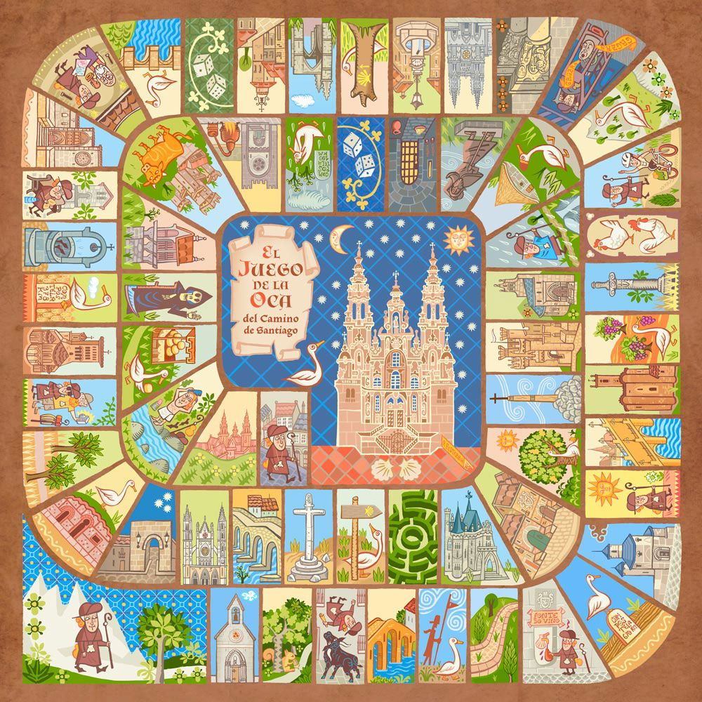

```text
生成一张古典竞速/人生路径桌游版图，方形或近方形，俯视正交。
版图中央有装饰性主题插画，四周环绕多圈路径格，格子包含事件、奖励、惩罚、转向和特殊图标。
风格为复古印刷、细线装饰、暖色纸张、对称构图，像 19 世纪或老式家庭桌游。
需要清楚的起点、终点和路径方向，不要只画装饰图案。
文字简体中文或少量标题，整体可读。
```

**可迁移结构：** 中央主题图 + 环绕路径格 + 复古印刷装饰。

---


## 例 918：手绘叙事地图版图

**来源：** 用户新增本地参考图

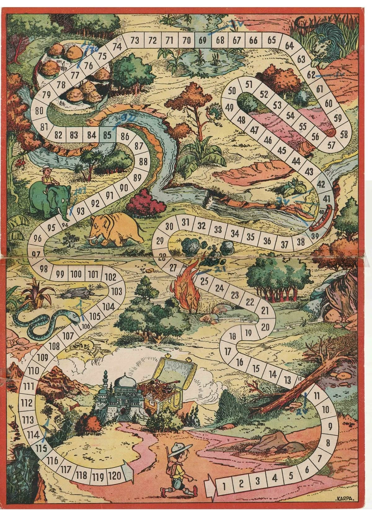

```text
生成一张手绘叙事型桌游地图版图，竖版或方形，俯视。
地图表现山谷、城镇、河流、森林、桥梁和路线，路径以蜿蜒轨迹连接多个地点。
每个地点有小插画和图标标记，适合冒险、旅行、任务推进或故事战役桌游。
风格为复古手绘地图，暖色纸张、水彩、钢笔线条，信息清晰但有探索感。
必须有可走路线、节点和区域边界，不要只是普通风景画。
```

**可迁移结构：** 叙事地图 + 路线节点 + 地点小插画。

---


## 例 919：迷宫圆盘版图

**来源：** 用户新增本地参考图

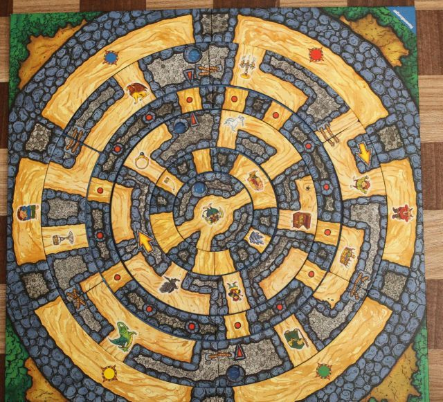

```text
生成一张圆形迷宫桌游版图，正方形画幅，俯视正交。
中央是同心圆迷宫，路径由石墙、砖块或图案边界组成，分布入口、出口、陷阱、宝物和特殊房间。
配色为蓝、金、米色或石质色，整体有古代遗迹或神庙感。
迷宫路径必须清楚可追踪，墙体和通道边界明确，不要变成纯装饰曼陀罗。
适合解谜、探索、地牢或竞技桌游。
```

**可迁移结构：** 同心圆迷宫 + 可玩通道 + 特殊格点。

---


## 例 920：模块化六边形地形板

**来源：** 用户新增本地参考图

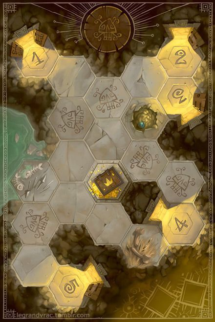

```text
生成一张模块化六边形地形版图，竖版或方形，俯视正交。
由多个六边形地块拼成地图，包含荒地、矿洞、火山、森林、河流或资源点。
每个六边形边界清楚，资源图标和特殊地形点可读，整体带有奇幻冒险或策略探索氛围。
光影可以有戏剧感，但不能遮挡六边形格子结构。
适合领地扩张、探索、资源采集类桌游。
```

**可迁移结构：** 六边形地块 + 地形差异 + 资源/事件点。

---


## 例 921：抽象六边形策略棋盘

**来源：** 用户新增本地参考图

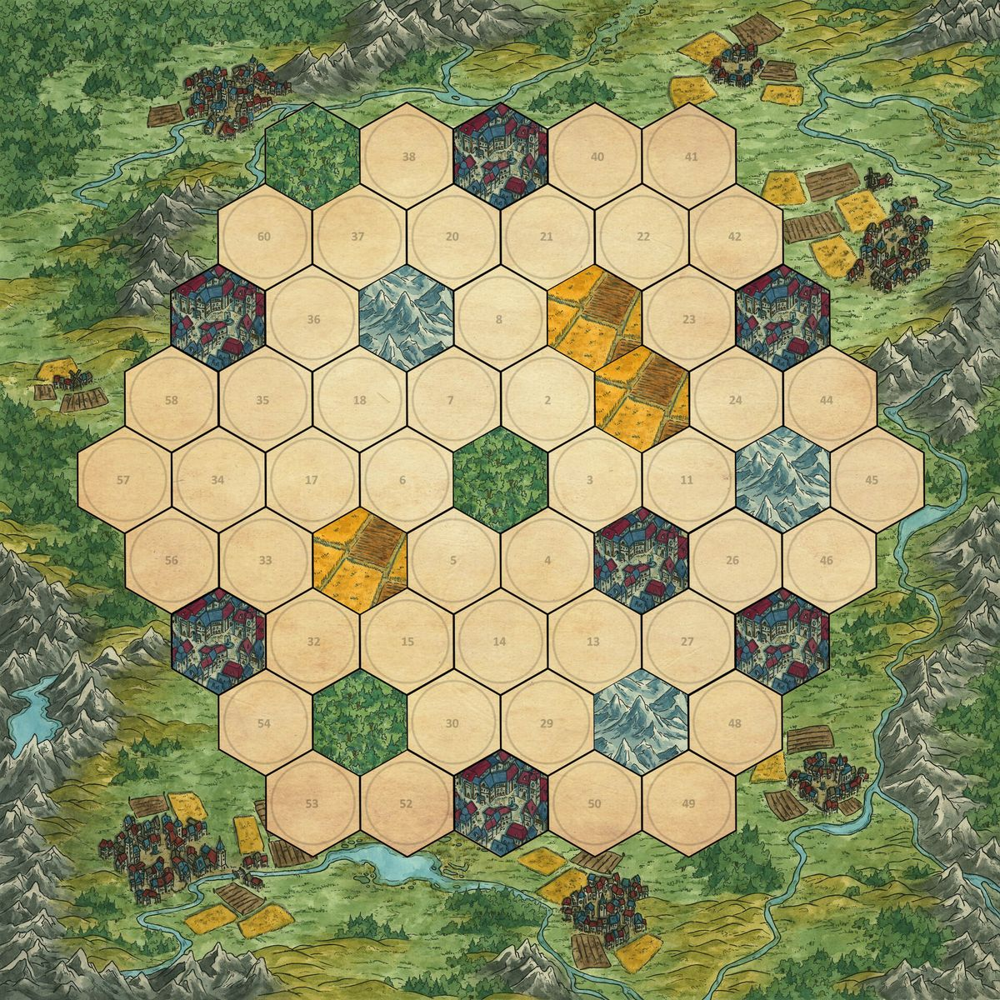

```text
生成一张抽象策略桌游六边形棋盘，正方形画幅，俯视。
棋盘由规则六边形格组成，中间为浅色空地，周边有深色山地、森林、水域或障碍格。
整体背景为自然地貌插画，但格线必须清楚、均匀、可用于放置棋子。
视觉克制、干净，适合战术、围控、区域控制或抽象策略游戏。
不要加入复杂文字，不要让格线被纹理淹没。
```

**可迁移结构：** 规则六边形棋盘 + 地形环绕 + 低文字策略版。

---


## 例 922：科幻设施地图板

**来源：** 用户新增本地参考图

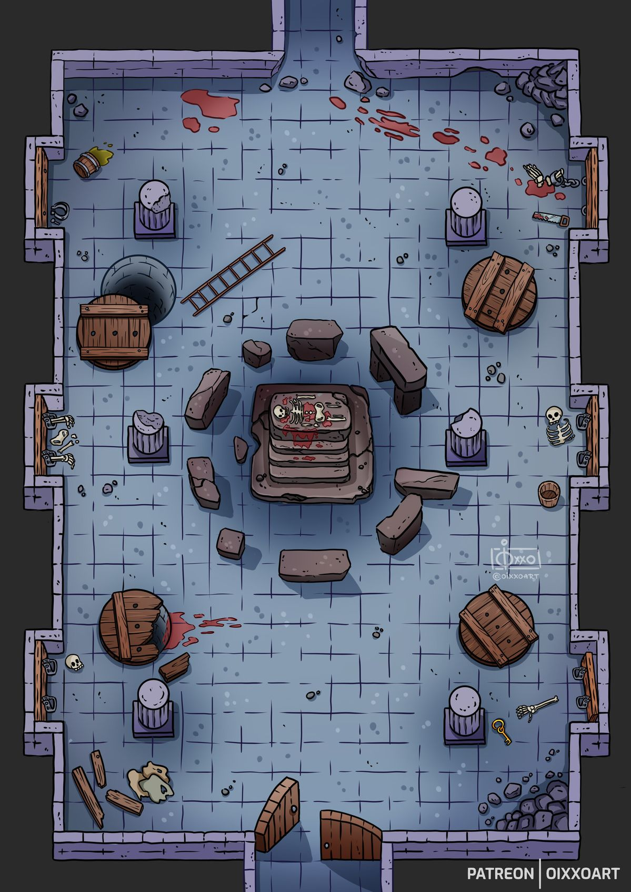

```text
生成一张科幻设施/飞船内部地图板，竖版或方形，俯视正交。
地图包含多个房间、走廊、控制台、舱门、能源核心和任务点，整体蓝灰色冷光。
每个房间边界清晰，路径连通关系明确，适合作为战术移动或任务探索桌游版图。
可以加入少量编号、危险标记和区域图标，但不要做成电子游戏截图。
风格为实体桌游地图板，印刷清晰，微缩模型可摆放。
```

**可迁移结构：** 房间网格 + 走廊连通 + 任务点/危险标记。

---


## 例 923：地牢房间地图板

**来源：** 用户新增本地参考图

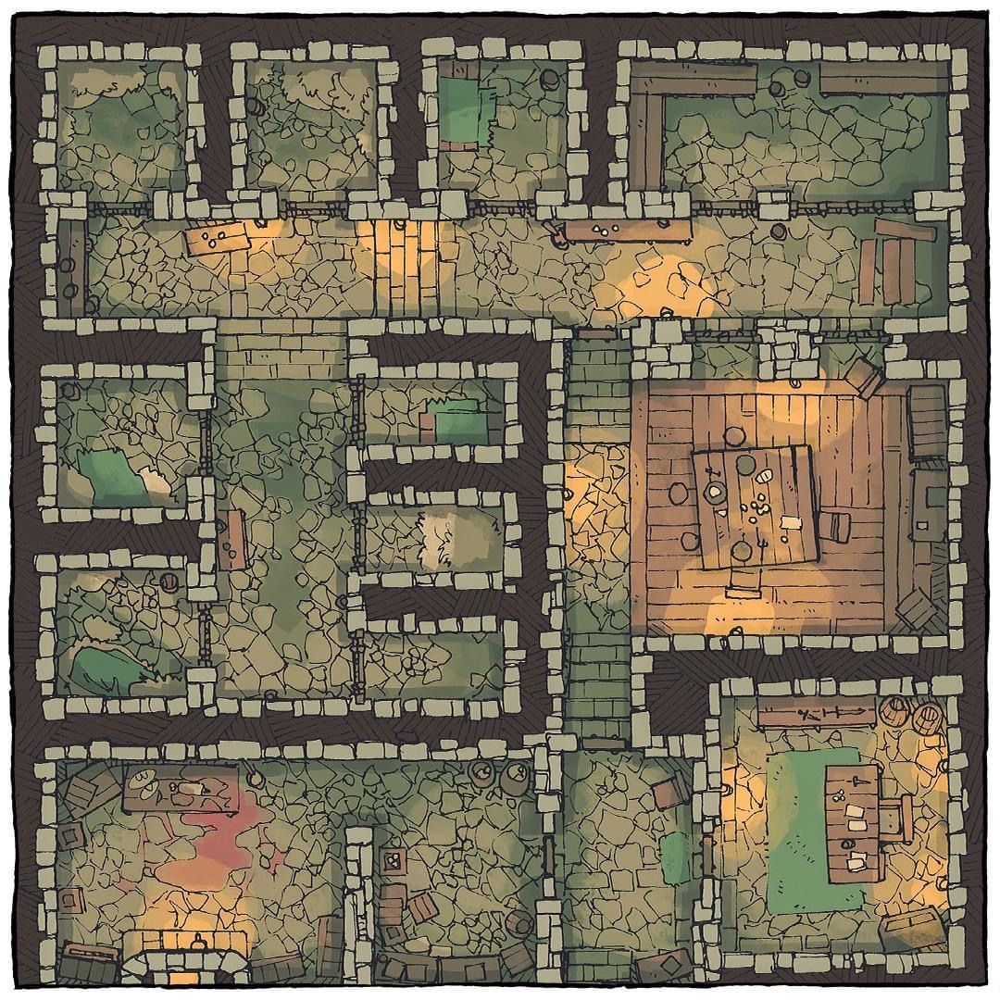

```text
生成一张地牢探索桌游地图板，横版或方形，俯视正交。
地图由多个石墙房间、走廊、门、宝箱、火把、陷阱和怪物出生点组成。
使用暗绿色、棕色、石板灰和暖光火把，营造地下城氛围。
房间边界、可通行区域、门和障碍物必须清楚，适合放置棋子或微缩模型。
避免纯氛围插画；必须保留可玩的空间结构。
```

**可迁移结构：** 地牢房间 + 门/走廊/陷阱 + 可摆棋子的俯视格局。

---


## 例 924：村庄区域控制版图

**来源：** 用户新增本地参考图

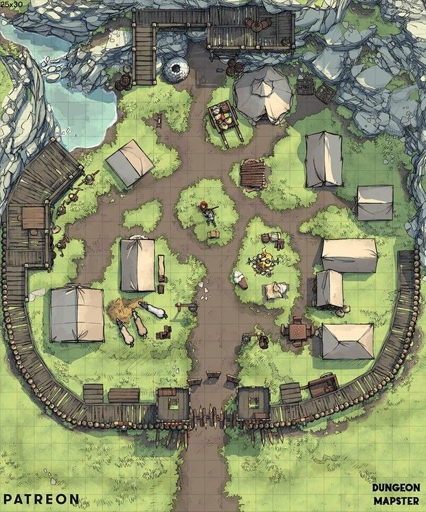

```text
生成一张村庄区域控制桌游版图，方形，俯视手绘。
版图中央是村庄、广场或市场，周围分布道路、农田、树林、房屋和多个可占领区域。
每个区域边界用道路、篱笆、河流或色块区分，适合放置工人、资源或控制标记。
风格为温暖的欧式桌游地图插画，信息清楚，色彩自然。
少量中文区域标签可选，避免密集文字。
```

**可迁移结构：** 村庄中心 + 区域分割 + 可放置 token 的地点。

---


## 例 925：城市路线网络版图

**来源：** 用户新增本地参考图

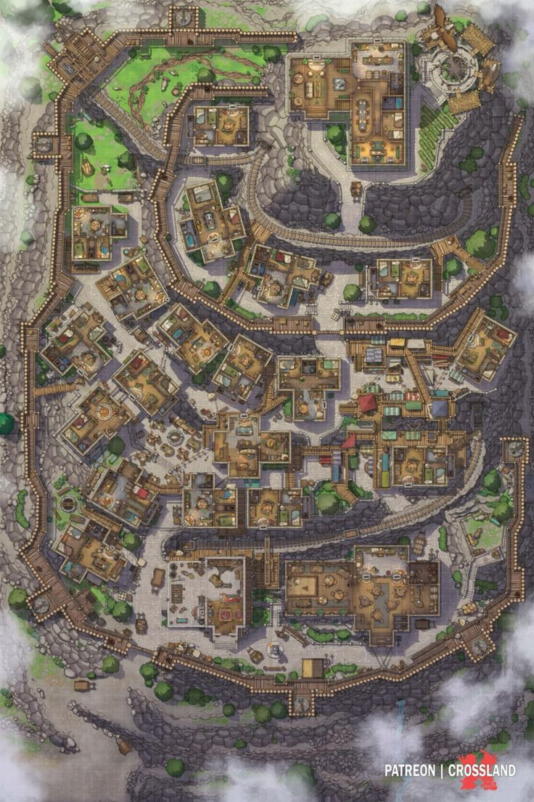

```text
生成一张城市路线网络桌游版图，竖版或方形俯视地图。
地图包含密集街区、道路、河流、桥梁、地标和多个任务节点，路线连接关系清晰。
适合物流、竞速、侦探、城市建设或区域控制游戏。
风格为精细手绘城市地图，颜色偏自然灰绿和棕色，带清晰道路层级。
必须突出可玩节点和路线，不要只是普通旅游地图。
```

**可迁移结构：** 城市地图 + 路线网络 + 地标节点。

---


## 例 926：海岛圆形区域版图

**来源：** 用户新增本地参考图

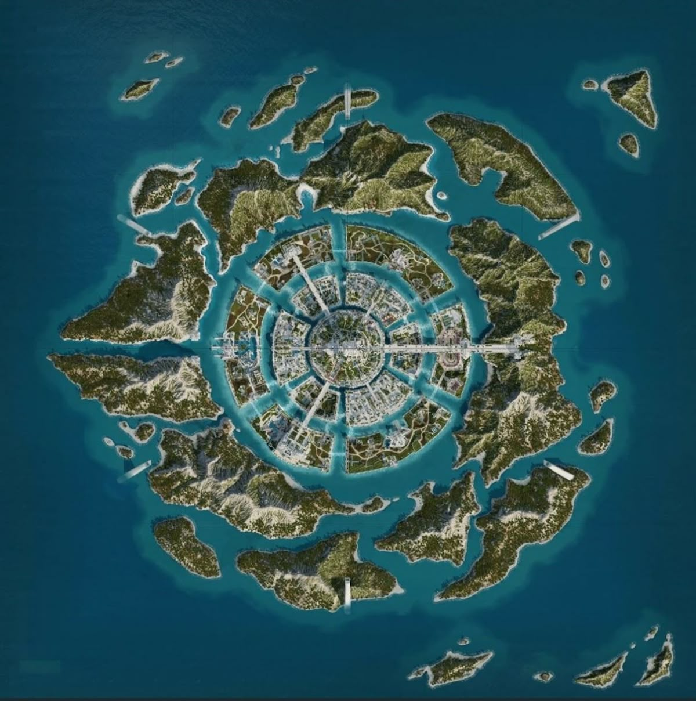

```text
生成一张海岛探索桌游版图，方形画幅，俯视。
中央是一座圆形或环形海岛，周围是深蓝海水；岛上划分为多个区域，包含港口、森林、山地、遗迹、村庄和道路。
整体为高饱和奇幻地图风格，区域边界和移动路线清晰。
可加入资源点、任务点、危险标记和起始港口图标。
适合探索、贸易、海盗、冒险或区域控制桌游。
```

**可迁移结构：** 环形岛屿 + 区域分区 + 港口/道路/任务点。

---


## 例 927：奇幻大陆区域地图

**来源：** 用户新增本地参考图

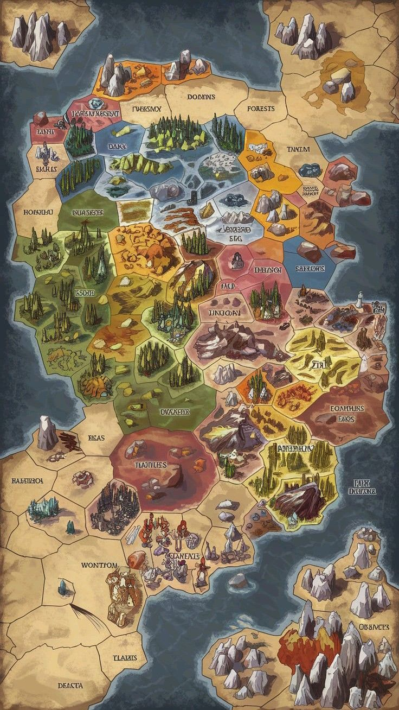

```text
生成一张奇幻大陆区域控制版图，竖版或方形，俯视。
地图由多个彩色地形区域组成，包括沙漠、森林、山脉、湖泊、城镇、遗迹和魔法区域。
每个区域有清楚边界、少量图标和连接路线，适合放置控制标记。
风格为明亮的现代桌游地图插画，细节丰富但不影响规则可读性。
不要做成无边界的大幅风景画；必须有游戏区域结构。
```

**可迁移结构：** 多地形区域 + 明确边界 + 控制/移动节点。

---


## 例 928：大型乐园式路线版图

**来源：** 用户新增本地参考图

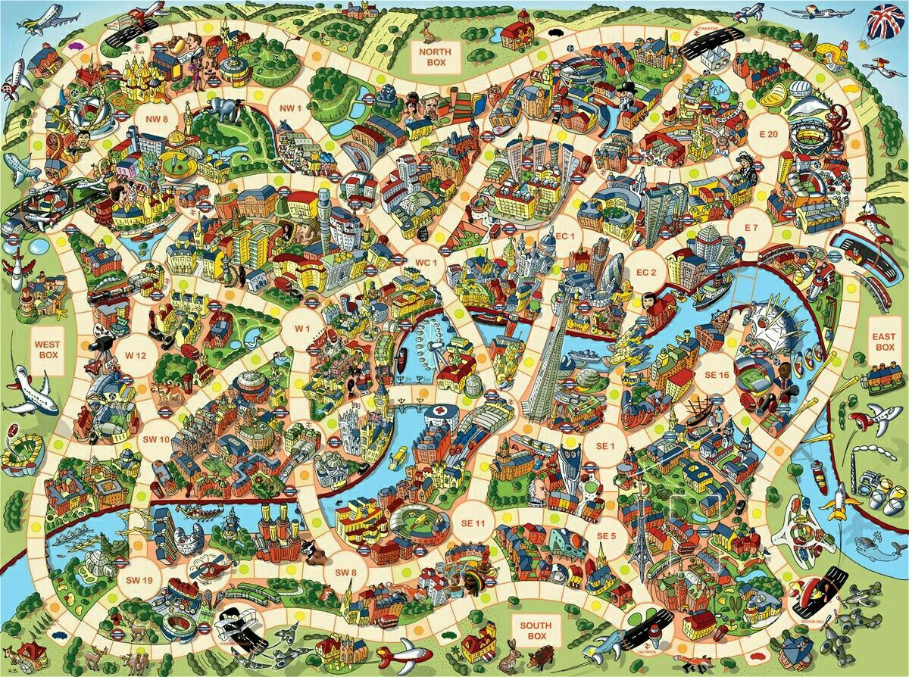

```text
生成一张大型乐园/城市游览路线桌游版图，横版 16:9 或 4:3，俯视。
地图包含河流、街区、桥梁、建筑群、景点、游乐设施和大量连接路线，整体明亮热闹。
路径、节点、区域和特殊地点必须清楚，适合多人竞速、收集、游览或任务打卡游戏。
风格为详细手绘插画地图，色彩丰富，像家庭桌游的主版图。
少量中文地名和图标标签可选，但不要让文字过密。
```

**可迁移结构：** 大型开放地图 + 多路线网络 + 景点节点。

---


## 例 929：垂直岛屿竞速版图

**来源：** 用户新增本地参考图

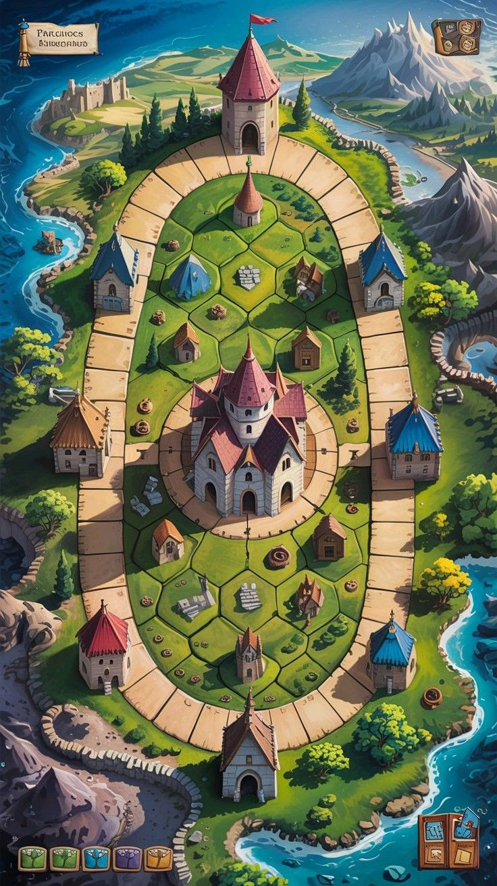

```text
生成一张垂直构图的岛屿竞速/冒险桌游版图，竖版 9:16 或 3:4，俯视。
版图从底部入口延伸到顶部目标点，中间穿过环形道路、桥梁、村庄、森林、水域和城堡。
路线方向清楚，关键节点有图标标记，适合线性推进、竞速、任务解锁或章节式冒险。
风格为明亮幻想地图插画，绿色、蓝色和紫色点缀，整体像可折叠游戏板。
避免：不要把路线藏在装饰里；不要变成普通海报。
```

**可迁移结构：** 竖向推进路线 + 岛屿分区 + 顶部目标建筑。

---


## 例 930：高能邪典喜剧桌游盒面

**来源：** 用户新增本地参考图

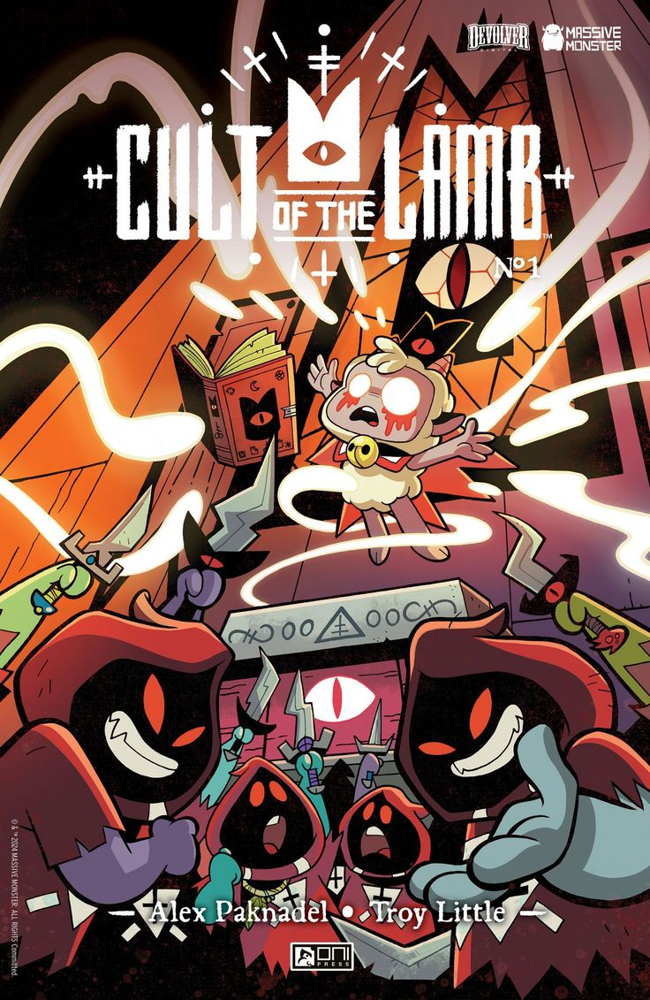

```text
设计一张高能量桌面游戏盒面正面图，竖版 2:3，纯正面平视，完整封面居中。
画面中央是一群夸张表情的动物、怪物或异教团角色，围绕一个强烈的中心事件展开：祭坛、赛车、仪式、逃亡或混乱派对。
构图使用强透视的放射线、对角动势和前景角色压迫感，形成“所有角色都冲向画面中心”的戏剧张力。
标题位于顶部，占据清晰的品牌区，使用厚重、尖锐、略带手绘感的中文标题字；底部保留很小的出版信息区。
配色为黑、红、奶白、橙色和少量高亮色，粗线条卡通插画，黑色阴影强烈，适合黑色幽默、派对、冒险或轻策略桌游。
避免：不要直接复刻真实游戏名、商标或角色；不要做成普通海报；不要出现价格、二维码、水印；标题必须可读。
```

**可迁移结构：** 顶部大标题 + 中央混乱事件 + 多角色放射式动势 + 黑红高对比喜剧邪典气质。

---


## 例 931：宁静自然绘本桌游盒面

**来源：** 用户新增本地参考图

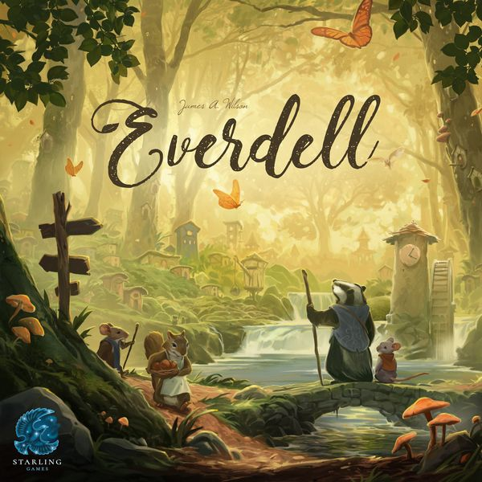

```text
设计一张宁静自然题材桌游盒面正面图，方形或近方形，纯正面展示。
画面是一处温暖的森林溪谷、树屋村落或小动物聚居地，前景有几位小动物角色从背影或侧影望向远处，形成进入世界的邀请感。
标题位于画面上方或中上部，使用优雅手写感中文标题字，标题与树冠、阳光、薄雾自然融合但保持清晰可读。
整体为高级绘本插画与欧式家庭桌游封面结合：柔和金绿色、晨雾、层次丰富的树木、溪流、远景建筑和温暖光线。
封面要传达探索、建造、季节、森林生态或温柔冒险感，适合家庭、轻中策、自然经营类桌游。
避免：不要过度商业海报化；不要加入手机 UI；不要直接复刻真实游戏名或出版社标志；不要让标题被背景淹没。
```

**可迁移结构：** 大面积自然场景 + 小角色背影引导 + 手写标题融入环境 + 温柔世界观封面。

---


## 例 932：周年纪念角色群像封面

**来源：** 用户新增本地参考图

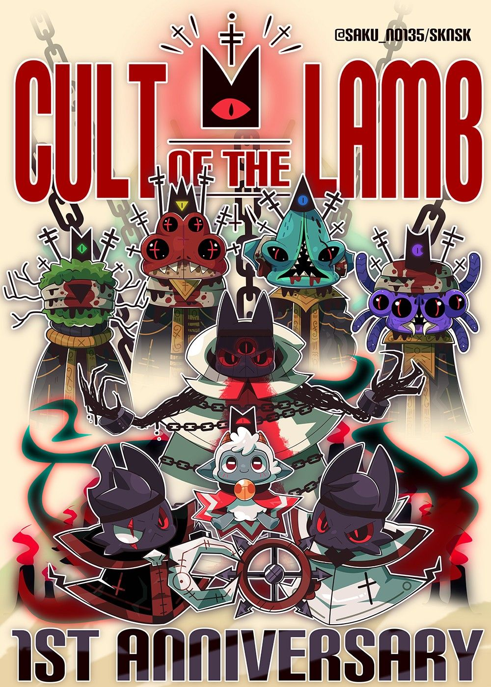

```text
设计一张桌面游戏周年纪念版盒面正面图，竖版 2:3，纯正面平视。
顶部使用超大中文游戏标题，红黑或高对比配色，标题下方写“周年纪念版”或“特别版”作为副标题。
中央是多个阵营角色或怪物的对称群像：主角在中心，两侧角色按颜色、阵营或身份分层排列，形成舞台海报式构图。
底部可以出现一个核心道具、徽章、地图盘或仪式桌，作为系列世界观的锚点。
风格为粗线条卡通插画、强装饰边框、节庆但略带黑色幽默，适合周年版、典藏版、扩展合集或角色大集合封面。
文字使用简体中文，标题清晰可读，避免小字过多。
避免：不要直接使用真实游戏名、真实商标、真实角色；不要生成电商价格或促销标签；不要变成普通角色海报。
```

**可迁移结构：** 超大标题 + “周年/特别版”副标题 + 对称角色群像 + 中央世界观道具。

---


## 例 933：横版扩展包叙事封面

**来源：** 用户新增本地参考图

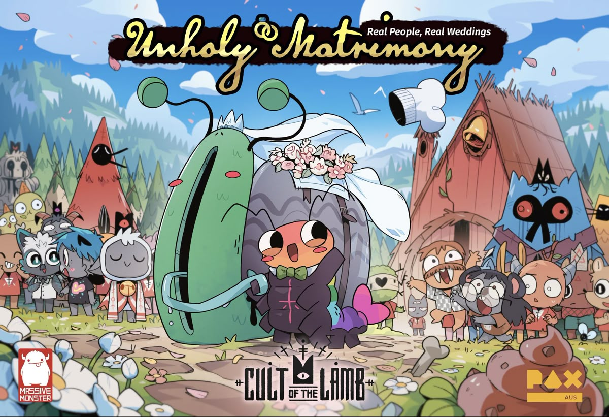

```text
设计一张横版桌游扩展包或宣传封面，比例 16:9，纯正面画面。
画面中央是一个幽默的叙事冲突场景，例如婚礼、联盟、谈判、节庆、审判或村庄事件；主角站在中央，左右两侧是不同阵营的小动物、怪物或村民围观。
远景是山谷、村庄、帐篷、旗帜和天空，整体像可爱动画剧集的关键场景，但构图服务于桌游扩展包封面。
标题位于顶部中央，使用装饰性中文手写标题，右上角可放 2-3 个简短卖点标签；底部保留游戏系列标识和小型出版信息区。
配色明亮、角色密集但层级清楚，适合扩展包、剧情章节、活动场景或众筹页横幅。
避免：不要直接复刻真实游戏名或展会 logo；不要加入价格、二维码、水印；不要让角色遮挡标题。
```

**可迁移结构：** 横版标题区 + 中央喜剧事件 + 两侧阵营围观 + 扩展包/剧情章节信息区。

---

## 使用提示

- 做“卡牌”时先读 `recipes/boardgame-card.md`，并区分牌面正面图、产品效果图、系列卡牌、合集图。
- 做“版图/地图板”时优先使用本库的例 916-929，并明确俯视正交、可玩路径、格子/节点/区域边界。
- 做“桌游封面/盒面/扩展包包装”时优先使用本库的例 930-933，并补读 `recipes/boardgame-cover.md`；默认区分盒面正面、盒子效果图、宣传封面海报和系列包装。
- 做“玩家面板/资源板/帮助卡”时结合例 915，并补读 `recipes/boardgame-ui.md` 或 `recipes/boardgame-rulebook.md`。
- 做“规则机制图”时以本库为主题辅助库，同时补读 `db/图表与信息可视化/prompt.md` 和 `recipes/infographic.md`。
- 做“宣传海报/众筹详情页/电商图”时本库提供组件语言和封面主视觉，主库仍按交付物切到 `db/海报与排版/` 或 `db/商品与电商/`。


