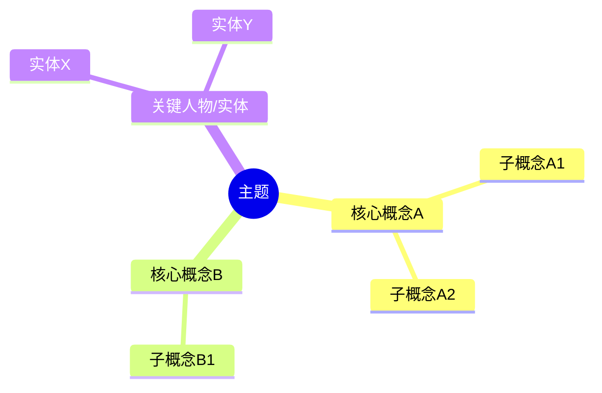

# 思维导图/知识图谱包（graph-pack）

**用途**：把可信资产可视化为思维导图/知识图谱，用于演示、概览、嵌入。

**启发来源**：notebookllama 的 mind_map。

**条目类型**：`synthesis`（图谱是综合产物）

**产出三件套 + 图谱文件**：
```
graph-pack/
├── USAGE.md
├── INDEX.md
├── overview.mmd          # mermaid 思维导图（纯文本，任何 markdown 渲染器可显示）
├── graph.json            # 结构化 nodes/edges（供程序消费）
└── outline.md            # markdown 大纲（无渲染器时的人读版本）
```

**mermaid 思维导图示例**（overview.mmd）：


**graph.json 结构**：
```json
{
  "nodes": [
    {"id": "concept_a", "label": "核心概念A", "type": "concept", "group": "core"},
    {"id": "entity_x", "label": "实体X", "type": "entity", "group": "people"}
  ],
  "edges": [
    {"from": "concept_a", "to": "entity_x", "label": "提出"},
    {"from": "concept_a", "to": "concept_b", "label": "对比"}
  ],
  "sources": {"concept_a": ["src_001"], "entity_x": ["src_002"]}
}
```

**outline.md**：当 mermaid 渲染不可用时，用缩进列表表达同一结构。

**生成逻辑**：
1. 从可信资产里提取概念/实体/关系。
2. 按重要性分层（核心概念→子概念→实例）。
3. mermaid + json + outline 三种格式同源生成，覆盖不同消费场景。

**USAGE.md 要点**：
- 适合需要可视化概览/演示的人。
- mermaid 可嵌入任何支持它的 markdown（Obsidian/Typora/GitHub/Notion）。
- graph.json 可喂给可视化工具或前端。
- `citable: false`（图谱结构是综合判断，引用具体节点应回对应资产）。
